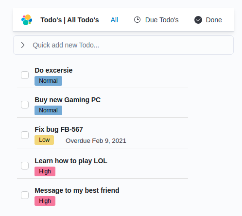
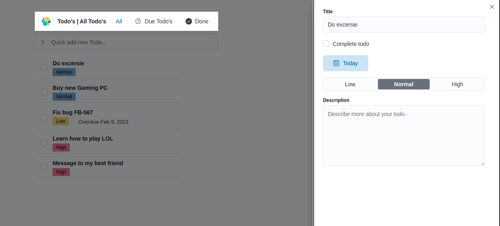
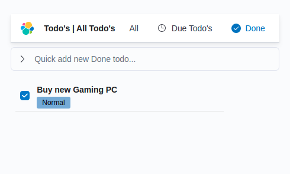

# todo-app
A small project about Todo application. It includes both Backend service and UI. Backend service is devloped by framework Hapi and UI is developed by React + [ElasticUI](https://elastic.github.io/eui/)

## Teckstacks
+ Framework Nodejs [Hapi](https://hapi.dev/)
+ ReactJS
+ ElasticUI
+ Docker

## GUI
+ Overview

+ Edit todo item

+ Todo complete

## How to run
1. Install docker and docker compose. Reference at https://docs.docker.com/engine/install.
2. Build docker images `docker-compose build`
3. Add owner permission for .docker folder `sudo chown -R 1001 .docker`
4. Start all services by: `docker-compose up -d`
5. Open website at http://localhost:13010

